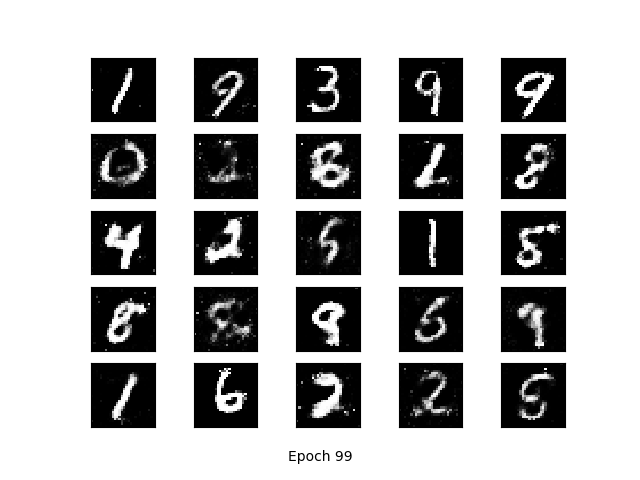
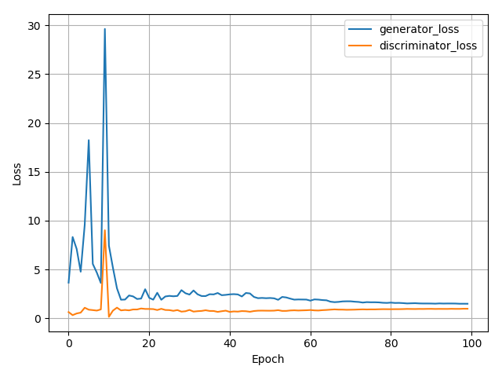

# GAN-pytorch
Implement Generative Adversarial Networks (GAN)  and its variants using Pytorch step by step:

* GAN on MNIST
* DCGAN on MNIST
* ...


### Experiments and Results

---

#### GAN on MNIST

* Network structure

```Cmd
Generator(
  (fc1): Linear(in_features=100, out_features=256, bias=True)
  (fc2): Linear(in_features=256, out_features=512, bias=True)
  (fc3): Linear(in_features=512, out_features=1024, bias=True)
  (fc4): Linear(in_features=1024, out_features=784, bias=True)
)
Discriminator(
  (fc1): Linear(in_features=784, out_features=1024, bias=True)
  (fc2): Linear(in_features=1024, out_features=512, bias=True)
  (fc3): Linear(in_features=512, out_features=256, bias=True)
  (fc4): Linear(in_features=256, out_features=1, bias=True)
)

```

* Results

|           results after 100 epochs            |                   training process                    |                  training loss                  |
| :-------------------------------------------: | :---------------------------------------------------: | :---------------------------------------------: |
|  |  |  |


### Reference

---

https://github.com/znxlwm/pytorch-MNIST-CelebA-GAN-DCGAN


